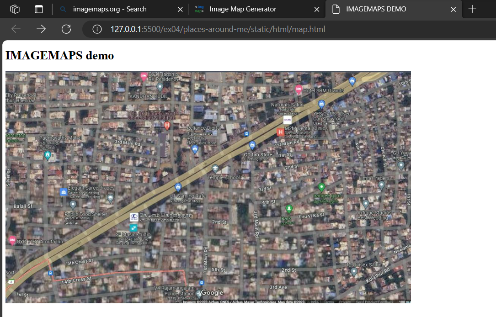
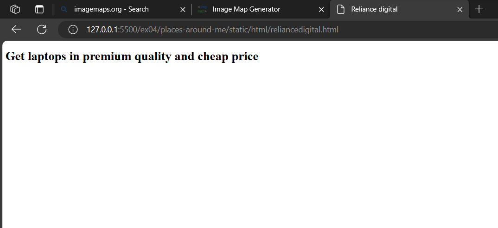
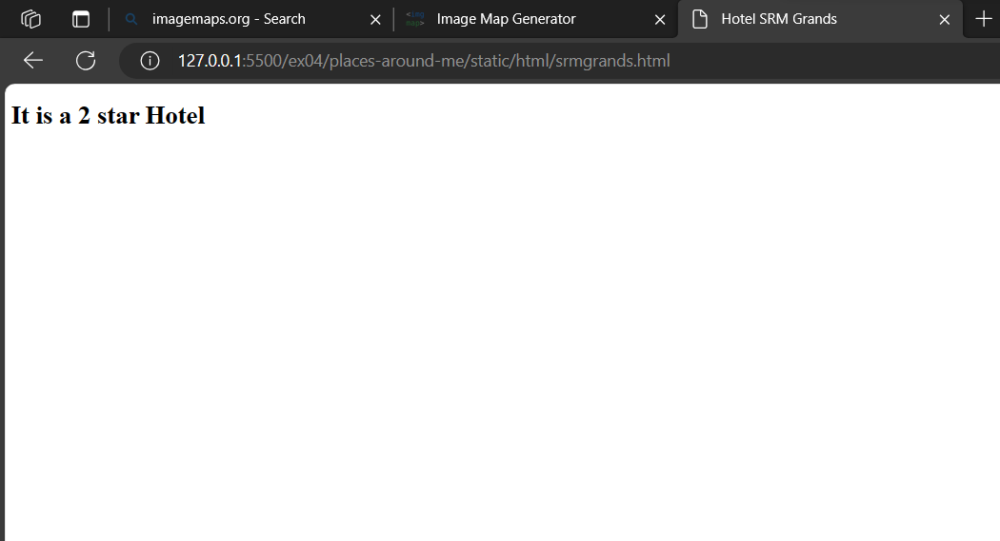
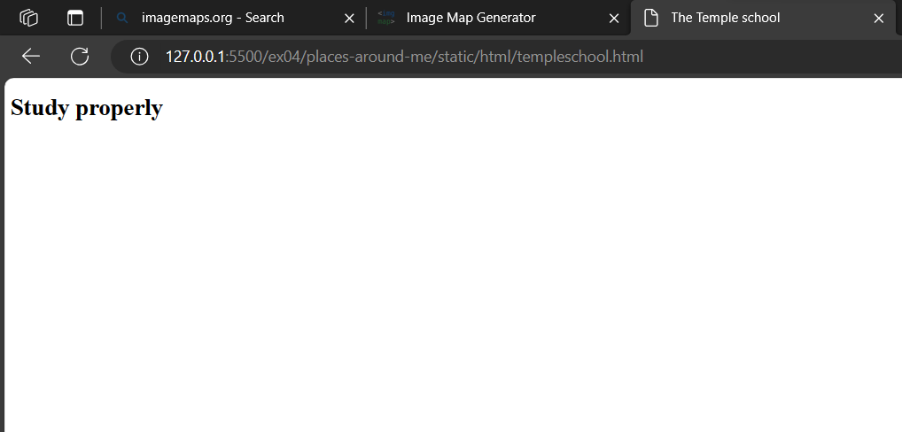
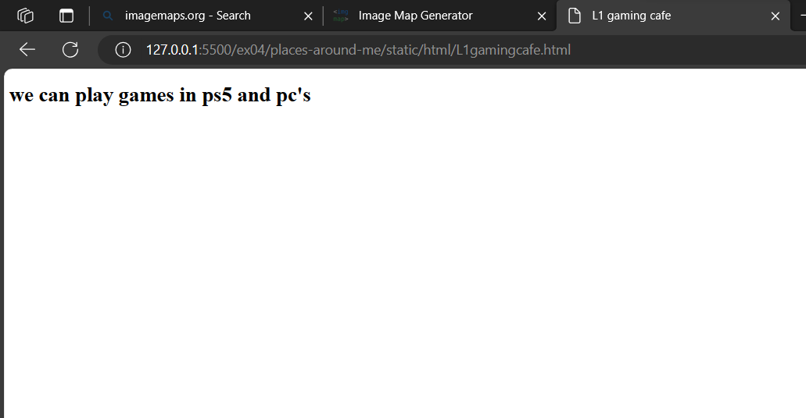

# Places Around Me
## AIM:
To develop a website to display details about the places around my house.

## Design Steps:

### Step 1:
clone the github repository into the IDE

### Step 2:
create a django project

### Step 3:
write the needed HTML code

### Step 4:
run the django server and excute the HTML files
## Code:
map.html
```html
<!DOCTYPE html>
<html>
    <head>
        <title>
            IMAGEMAPS DEMO
        </title>
    </head>
    <body>
        <h1>IMAGEMAPS demo</h1>
            
            <map name="image_map">
                <area alt="srmgrands" title="srmgrands" href="srmgrands.html" coords="748,32,809,64" shape="rect">
                <area alt="templeschool" title="templeschool" href="templeschool.html" coords="525,248,601,285" shape="rect">
                <area alt="L1gamingcafe" title="L1gamingcafe" href="L1gamingcafe.html" coords="428,292,499,332" shape="rect">
                <area alt="Rajamangalamcops" title="Rajamangalamcops" href="Rajamangalamcops.html" coords="384,557,526,601" shape="rect">
                <area alt="reliancedigital" title="reliancedigital" href="reliancedigital.html" coords="473,175,555,231" shape="rect">
            </map>
    </body>
</html>
```
L1gamingcafe.html
```html
<!DOCTYPE html>
<html>
    <head>
        <title>
            L1 gaming cafe
        </title>
    </head>
    <body>
        <h1>
            we can play games in ps5 and pc's
        </h1>
    </body>
</html>
```
Rajamangalamcops.html
```html
<!DOCTYPE html>
<html>
    <head>
        <title>
            Rajamangalam police station
        </title>
    </head>
    <body>
        <h1>
            Don't go there on buisness work
        </h1>
    </body>
</html>
```

reliancedigital.html
```html
<!DOCTYPE html>
<html>
    <head>
        <title>
            Reliance digital 
        </title>
    </head>
    <body>
        <h1>
            Get laptops in premium quality and cheap price
        </h1>
    </body>
</html>
```
srmgrands.html
```html
<!DOCTYPE html>
<html>
    <head>
        <title>
            Hotel SRM Grands
        </title>
    </head>
    <body>
        <h1>
            It is a 2 star Hotel
        </h1>
    </body>
</html>
```

templeschool.html
```html
<!DOCTYPE html>
<html>
    <head>
        <title>
            The Temple school
        </title>
    </head>
    <body>
        <h1>
            Study properly
        </h1>
    </body>
</html
```

## Output:
Server output


Map output





## Result:
The program for implementing image map is excuted sucessfully.